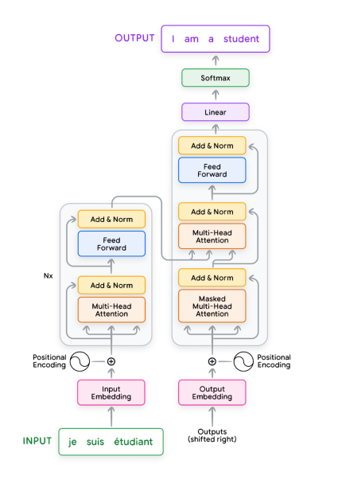

# Foundational LLMs and Text Generation

> Based on whitepaper: https://www.kaggle.com/whitepaper-foundational-llm-and-text-generation

## Introduction
Advent of LLMs(Large Language Models) has revolutionized the world of Artificial Intelligence. Their ability to process, 
generate, and understand user intent is fundamentally changing the way we interact with information and technology.

## Table of Contents
- Building Blocks of LLMs
- Transformer Architecture
- Attention Mechanism
- LLMs such as BERT, GPT, Gemini
- Training and Fine-tuning
- Improve and Optimize response generation

## Large Language Models
A language model predicts the probability of a sequence of words. For example, given the prefix “The most famous city in the US is…”, a language model might predict high
probabilities to the words “New York” and “Los Angeles” and low probabilities to the words “laptop” or “apple”.

Before the invention of transformers, popular approach of languages models were RNNs (Recurrent Neural Networks). Particularly, LSTMs (Long Short Term Memory) 
and GRUs (Gated Recurrent Units) were used. These models are sequential in nature, meaning they process one word at a time, which makes them slow and inefficient for long sequences.
The sequential nature of RNNs make them compute intensive and difficult to parallelize during training.

Transformers, on the other hand, are a type of neural network that can process sequences of tokens in parallel thanks to the self-attention mechanism.
This allows them to capture long-range dependencies and relationships between words more effectively than RNNs. 
However, transformers are still limited by the amount of data they can process at once, which is typically constrained by the size of the model and the available computational resources,
while RNNs theoretically have infinite context length. Although, in practice, RNNs are limited by the vanishing gradient problem(todo: what is it?), which makes it difficult for them to learn long-range dependencies.

### How LLMs Work
LLMs work on the power of next word prediction. They are trained on large datasets of text, learning to predict the next word in a sentence given the previous words.
We feed the model a sequence of words, and it predicts the next word in the sequence. This process is repeated until the model generates a complete sentence or reaches a specified length.

For example, given the input “The", the model might predict “cat” as the next word. Then it adds “cat” to the input and predicts the next word, making the input “The cat”.
Then given the input “The cat”, it might predict “sat” as the next word, and so on. 

This is done using a technique called **autoregression**, where the model generates one word at a time, conditioning on the previous words it has generated.
An example prompt template for supporting this is:

```
<SYSTEM>
You are a helpful assistant. Your task is to assist the user in generating text based on the given prompt.
<USER>
What is the capital of France?
<ASSISTANT>
```

This prompt template is used to instruct the model to generate a response based on the user’s input. The model will then generate a response based on the input it has received. at the first stage, it will only generate one word which gets added to the <ASSISTANT>.
```
<SYSTEM>
You are a helpful assistant. Your task is to assist the user in generating text based on the given prompt.
<USER>
What is the capital of France?
<ASSISTANT>
The
```

This will then be used as the input for the next stage, where the model will generate the next word. This process continues until the model generates a complete response or reaches a specified length.

```
<SYSTEM>
You are a helpful assistant. Your task is to assist the user in generating text based on the given prompt.
<USER>
What is the capital of France?
<ASSISTANT>
The capital
```

This auto regressive process allows the model to generate coherent and contextually relevant text based on the input it receives. It continues until the model encounters a <EOS> (end of sentence) token or reaches a specified length.

### Model preparation
The LLM models are trained in multiple stages.
1. **Pre-training**: The model is trained on a large corpus of text data to learn the underlying structure and patterns of the language. This stage is unsupervised, meaning the model learns from the data without any explicit labels or annotations.
    In this stage, the model just learns how a language works. It learns the grammar, syntax, and semantics of the language. It learns to predict the next word in a sentence given the previous words. The models created in this stage are called **foundational models**.
2. **Fine-tuning**: The foundational model is then fine-tuned on a smaller, task-specific dataset to adapt it to a specific application or domain. This stage is supervised, meaning the model learns from labeled data with explicit annotations.
    In this stage, the model learns to perform a specific task. For example, it can be fine-tuned to perform sentiment analysis, text classification, or question answering.
3. **Preference Alignment**: In this stage, a reward based learning approach is used to align the model's responses with human preferences. This is done by training the model on a dataset of human feedback, where humans rate the quality of the model's responses. 
   The model learns to generate responses that are more likely to be rated positively by humans.


## Transformer Architecture
The transformer architecture was developed at Google in 2017 for use in a translation model. It’s a sequence-to-sequence model capable of converting sequences from one domain into sequences in another domain.
For example, it can convert a sequence of words in English into a sequence of words in French. 
The original transfer architecture consisted of 2 parts, the encoder and the decoder. The encoder takes a sequence of words in the source language and converts it into a representation of the sequence in a continuous vector space.
The decoder takes this representation and converts it into a sequence of words in the target language.



The transformer consists of multiple layers. A layer in a neural network comprises a set of parameters that perform a specific transformation on the data. In the diagram you can see an example of some layers which include Multi-Head Attention, Add & Norm, Feed-Forward,
Linear, Softmax etc. The layers can be sub-divided into the input, hidden and output layers. The input layer (e.g., Input/Output Embedding) is the layer where the raw data enters the
network. Input embeddings are used to represent the input tokens to the model. Output embeddings are used to represent the output tokens that the model predicts. For example, in
a machine translation model, the input embeddings would represent the words in the source language, while the output embeddings would represent the words in the target language.
The output layer (e.g., Softmax) is the final layer that produces the output of the network. The hidden layers (e.g., Multi-Head Attention) are between the input and output layers and are where the magic happens!

## Steps of transformer architecture

### Dataset Preparation and Tokenization
